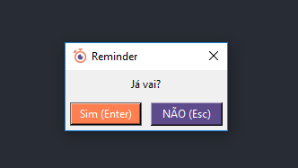
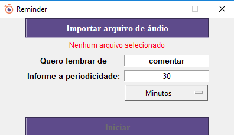
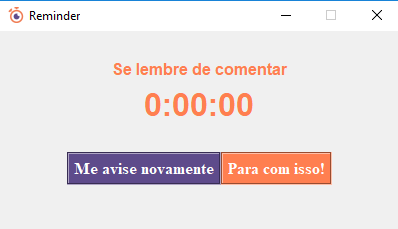

# Lembrete Sonoro    

Um programa para te lembrar de fazer algo reproduzindo um áudio de sua escolha em ciclos.

### Tópicos
* [Requerimentos](#requerimentos)

* [Personalizar](#Personalizar)

* [Montar o executável](#Montar-o-executável)

* [Download](#Download)

* [Como usar](#Como-usar)

## Requerimentos
* [Python 3](https://www.python.org/downloads/)

* [Tkinter](https://tkdocs.com/tutorial/install.html) - Uma biblioteca gráfica para python.  
A partir da versão 3.1 do Python essa biblioteca já está inclusa nas distribuiçõs Python. 
No windows pode ser instalado usando o prompt de comando ou o IDLE: 
No prompt de comando utilize o comando `python` para abrir a linha de comando Python. 
Para instalar o Tkinter utilize os dois comandos seguintes: 
`import tkinter` 
`tkinter._test()`

* [winsound](https://docs.python.org/3.7/library/winsound.html) - Uma biblioteca de interface de som para windows. 
Também já está incluso nas distribuições do Python, basta importar.

* [pyinstaller](https://pyinstaller.readthedocs.io/en/stable/)(Caso queira fazer a build do programa) - 
Um dos muitos programas que compila programas Python em executáveis stand-alone. 
Pode ser instalado com o comando `pip install pyinstaller`

## Personalizar
O programa tem apenas uma função: Lembrar o usuário de algo. 

Porém as palavras mostradas ao usuário podem ser alteradas. 

No início do script estão todas as variáveis do tipo string que serão mostradas ao usuário. 

Todas as variáveis têm comentários, então é fácil saber qual altera o quê.

Por exemplo: a caixa de diálogo de encerramento do programa.

Todas as palavras visíveis são definidas pelas variáveis(exceto o título da janela).

"Já vai?" é o valor da variável dialog_question;

"Sim (Enter)" é o valor da variável dialog_confirm;

"NÃO (Esc)" é o valor da variável dialog_cancel.

Simples, não?

## Montar o executável
Para simplificar, há um arquivo batch com os comandos necessários.

Execute o arquivo de lotes `build.bat` no windows. 
É necessário ter o pyinstaller instalado, pois ele é quem vai criar o executável.

Isso vai criar a pasta `Lembrete Sonoro` com o programa dentro do diretório atual. 
_Durante a build outras pastas são criadas, porém o arquivo `build.bat` as move para a lixeira._

## Download
Clique [aqui](https://github.com/kardoso/LembreteSonoro/releases/download/v0.1.0/LembreteSonoro.zip) para fazer o download.

A pasta `res` deve ser mantida na mesma pasta em que o executável está, pois sem ela o programa não será executado.

## Como usar
Este é o programa:

* No primeiro botão você seleciona o áudio que vai tocar. (No momento apenas no formato .wav)
* Logo abaixo do botão vai mostrar o arquivo que você carregou.
* Na caixa abaixo você informa a ação que você quer fazer depois que o temporizador chegar ao fim.
* Mais abaixo você informa o tempo, podendo escolher entre horas, minutos e segundos.
* E, enfim, o botão para iniciar o programa. (Ele fica ativo apenas quando há um arquivo de som selecionado)
* Ao iniciar você pode minimizar e ir fazer outra coisa

Ao final do tempo o som que você escolheu vai tocar e a janela aparecerá na tela com uma mensagem:

O som toca em loop até uma decisão ser tomada.
* O botão da esquerda recomeça o ciclo e conta novamente.
* O botão da direita fecha o programa(exibindo uma caixa de diálogo para confirmar a saída do programa).

